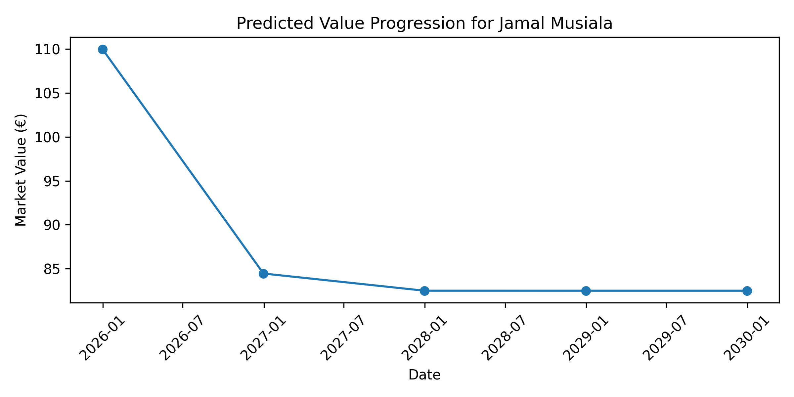
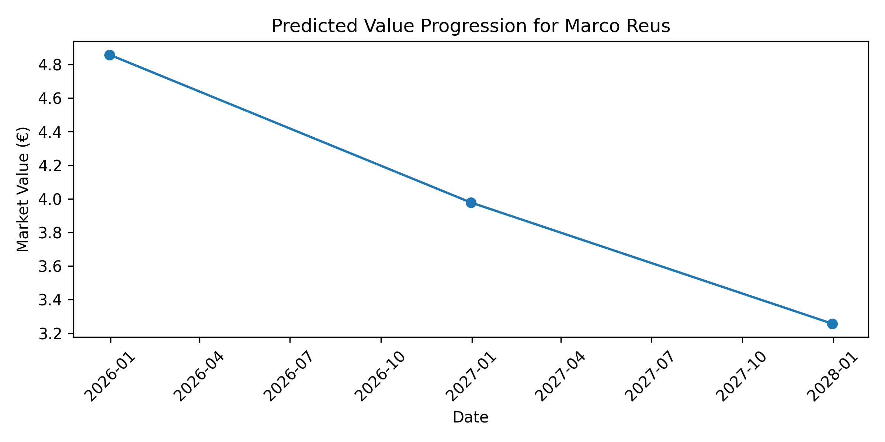
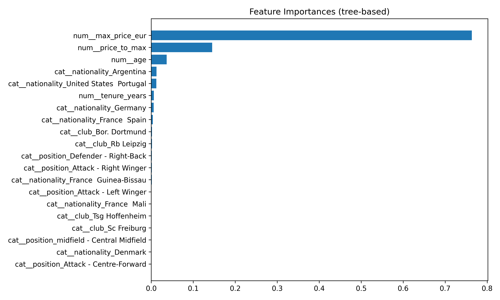
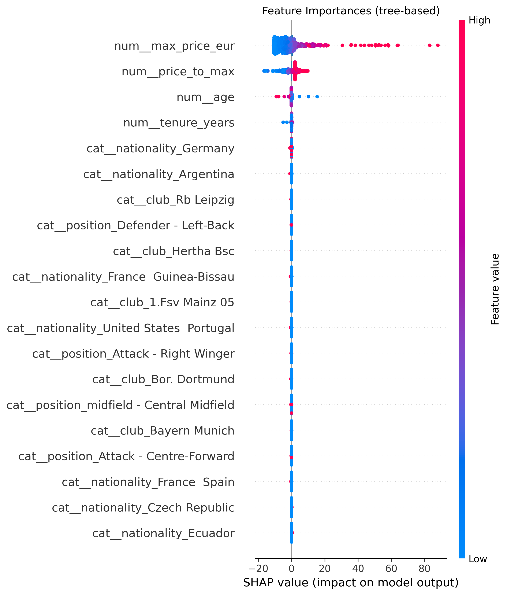

# End-to-End Demo: What You’ll Get

This short demo shows exactly what you (or a reviewer) will see when running the project: fresh tuning results, two example player projections, and explainability visuals — all saved as images you can open and share.

## Prerequisites
- Create a virtualenv and install dependencies:
```
python -m venv .venv && source .venv/bin/activate
pip install -r requirements.txt
```

## 1) Tune Models and Persist the Best Pipeline
Run the unified tuner. It uses the same features and preprocessor as production, evaluates several models, prints a comparison table, and saves the best pipeline to `models/best_pipeline.pkl`.
```
PYTHONPATH=src MPLBACKEND=Agg python src/model_tuning_and_comparison.py
```
Example output (your numbers may vary):
```
→ Tuning Ridge…
  • Best params: {'model__alpha': 10}
  • Test RMSE = 5.013, R² = 0.867

→ Tuning Lasso…
  • Best params: {'model__alpha': 0.1}
  • Test RMSE = 4.788, R² = 0.879

→ Tuning RandomForest…
  • Best params: {'model__max_depth': 10, 'model__n_estimators': 200}
  • Test RMSE = 3.209, R² = 0.946

→ Tuning XGBoost…
  • Best params: {'model__learning_rate': 0.1, 'model__n_estimators': 200, 'model__subsample': 1.0}
  • Test RMSE = 2.274, R² = 0.973

=== All models compared ===
          model      rmse        r2
0       XGBoost  2.274074  0.972686
1  RandomForest  3.208721  0.945619
2         Lasso  4.788240  0.878903
3         Ridge  5.012728  0.867282

[tuning] Saved tuned best pipeline to: models/best_pipeline.pkl
```

## 2) Generate Player Projections (Saved PNGs)
Project future market values for named players and save the resulting plots.
```
python src/cli.py "Jamal Musiala" --years 5 --freq YE --save outputs/musiala.png --no-show
python src/cli.py "Marco Reus"   --years 3 --freq YE --save outputs/reus.png    --no-show
```
What you’ll get:

- Jamal Musiala projection (saved):

  

- Marco Reus projection (saved):

  

Notes:
- Use `YE` (year-end). `Y` is deprecated in recent pandas.
- `--no-show` avoids opening a GUI window (handy for servers/CI),
- `--save` sets the output path.

## 3) Explainability (Global Importance + SHAP)
Create explainability graphics for the currently saved best pipeline.
```
PYTHONPATH=src MPLBACKEND=Agg python src/explainability.py \
  --save outputs/feature_importance.png \
  --shap --save-shap outputs/shap_summary.png
```
What you’ll get:

- Global feature importance (bar chart):

  

- SHAP summary plot (top features and direction of effect):

  

## 4) Optional: Interactive CLI
You can also run interactively and enter prompts on demand:
```
python src/cli.py --interactive
# or
python src/final.py  # defaults to interactive
```

## Recap: Artifacts Produced
- Tuned best pipeline: `models/best_pipeline.pkl` (used by the CLI)
- Projections saved: `outputs/musiala.png`, `outputs/reus.png`
- Explainability saved: `outputs/feature_importance.png`, `outputs/shap_summary.png`

Open these PNGs to see exactly what a user would get from running the project end‑to‑end.
